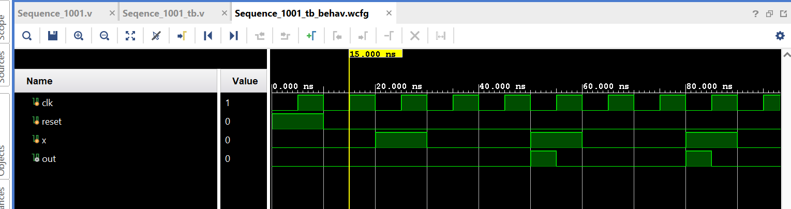

# 🔁 Sequence Detector (1001) using Mealy FSM – Verilog HDL

## 📘 Project Overview
This project implements a **Mealy-type Finite State Machine (FSM)** to detect
the binary sequence **1001** in a serial input stream.
The design is written in **Verilog HDL** and is fully synthesizable for FPGA implementation.

The output is asserted **immediately when the sequence is detected**, making
this a **Mealy FSM**.

---

## ⚙️ Features
- Detects binary sequence **1001**
- Mealy FSM implementation
- Overlapping sequence detection supported
- Asynchronous reset
- FPGA synthesizable
- Clean and modular Verilog design

---

## 🧠 FSM Description

### 🔹 States
| State | Meaning |
|------|--------|
| `s0` | Initial state / No match |
| `s1` | Detected `1` |
| `s2` | Detected `10` |
| `s3` | Detected `100` |

---

### 🔹 State Transitions
- `s0` → `s1` on input `1`
- `s1` → `s2` on input `0`
- `s2` → `s3` on input `0`
- `s3` → Output `1` on input `1` (sequence detected)

Overlapping detection is supported by transitioning back to `s1`.

## 📊 Simulation Waveform

The waveform below shows the detection of the sequence **1001**.
The output `out` goes HIGH when the final `1` is received.

